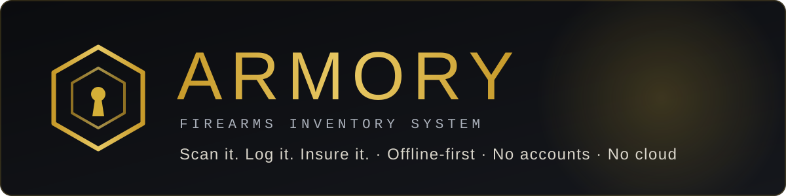
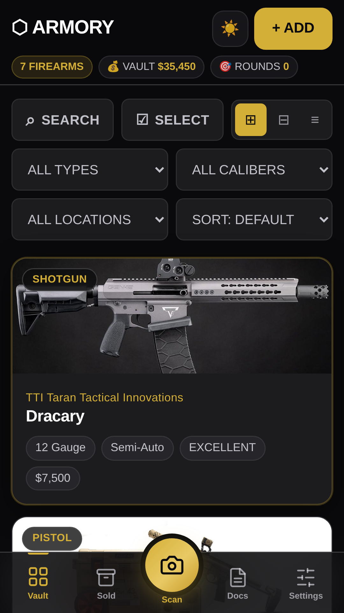
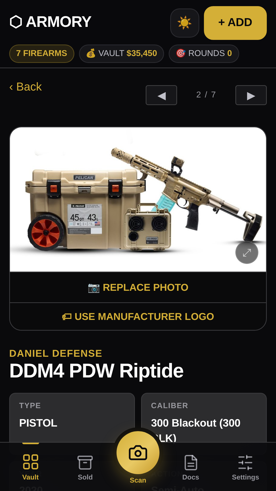
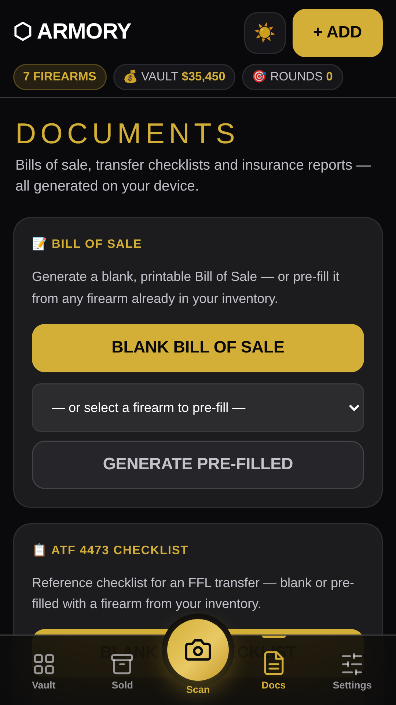
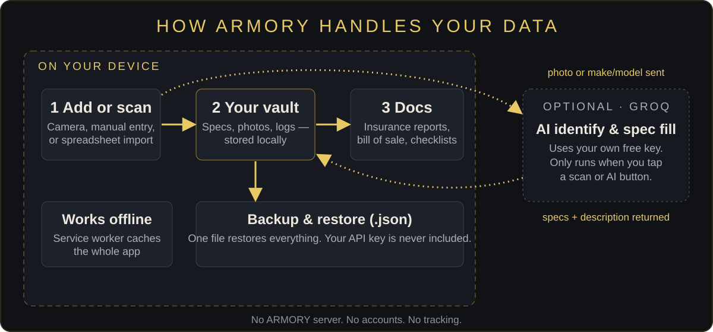

<div align="center">



**Private, offline-first firearms inventory. Scan it. Log it. Insure it.**

[**Landing page**](https://johnlaz.github.io/armory/) · [**Open the app**](https://johnlaz.github.io/armory/app/) · [Android APK](assets/ARMORY.apk)

</div>

---

## What it is

ARMORY is a Progressive Web App for cataloging a firearms collection. It installs on Android, iOS, Windows and macOS straight from the browser, runs offline, and keeps your data on your device. There are no accounts and no ARMORY servers.

<table>
<tr>
<td width="25%"></td>
<td width="25%"></td>
<td width="25%"></td>
<td width="25%" valign="middle"><sub>Screens show the built-in demo vault.</sub></td>
</tr>
</table>

**Features**

- **Vault** — grid, tile and list views; search, filter by type / caliber / location, and ten sort orders; live firearm count, vault value and rounds fired.
- **Scan** — point the camera at a firearm and vision AI proposes make, model and caliber. *AI fill* completes the spec sheet from make and model.
- **Records** — full spec sheet, hero photo plus gallery, range log, maintenance checklist and log, accessories, storage location, notes.
- **Docs** — insurance reports (single firearm or whole vault), blank or pre-filled Bill of Sale, and an ATF 4473 reference checklist. Reports open as print-ready pages; save them as PDF from the print dialog.
- **Sold archive** — retire a firearm from the vault and keep its record.
- **Import / export** — spreadsheet import (XLSX / CSV), Excel / CSV export, and a full JSON backup with merge or replace restore.
- **Demo vault** — seven sample firearms with photos load into an empty vault, and can be re-added any time from *Settings → Manage*.

## Live URLs

| | |
|---|---|
| Landing page | <https://johnlaz.github.io/armory/> |
| App | <https://johnlaz.github.io/armory/app/> |
| Android APK | <https://johnlaz.github.io/armory/assets/ARMORY.apk> |

## Repo layout

```
/index.html            landing page (installed-app launches redirect to /app/)
/README.md
/sw.js                 transitional worker — retires the pre-/app registration, then removes itself
/docs/                 README visuals only (banner.svg, how-it-works.svg, icon-tile.png)
/assets/ARMORY.apk     Android wrapper (Trusted Web Activity)
/app/index.html        the whole app — one file
/app/manifest.json
/app/sw.js
/app/icon-192.png      192 + 512, maskable-safe
/app/icon-512.png
/app/shot-*.png        manifest screenshots (phone ×3, desktop ×1)
/app/demo/*.jpg        demo-vault photos
/app/vendor/           xlsx.full.min.js (SheetJS 0.18.5, bundled so import/export work offline)
```

> `/sw.js` only exists so installs made before the move to `/app/` upgrade cleanly. It can be deleted after a few months.

## AI and model setup

AI features are optional and use **your own free [Groq](https://console.groq.com/keys) API key**.

1. Open **Settings → AI**, paste a key (starts with `gsk_`), and save.
2. The model list is pulled live from Groq when you save the key and whenever you tap 🔄.

How the model picker behaves:

- It **merges** — models Groq currently serves are added to the three built-in choices; nothing is removed.
- Your saved model is **never swapped automatically**. If Groq stops listing it, it stays selected and is flagged with ⚠.
- Non-chat models (speech, TTS, guard and safeguard classifiers, embeddings) are filtered out.
- If a call hits a rate limit or a retired model, the app tries the other available models for that request without changing your saved choice.

Default text model: `openai/gpt-oss-120b`. Camera identification picks a vision-capable model from the live list.

## Data and privacy



- Inventory, photos, logs, notes and settings are stored in your browser's **localStorage** on your device. There is no sync and no account.
- When you use a **scan** or **AI fill**, the photo or the make/model you entered is sent to **Groq**, using your key, and the answer comes back. Nothing is sent unless you use an AI feature.
- Your API key is stored locally, sent only to Groq, and **never included in backups**. Re-enter it after restoring on a new device.
- localStorage holds roughly 5 MB. *Settings → Data* shows how much you have used; photos are the main cost.
- Clearing site data or uninstalling the app erases your vault. **Export a backup regularly.**
- All GitHub Pages apps on `johnlaz.github.io` share one browser origin, so a stored key is visible to other apps on that origin. Keys are namespaced (`armory_*`) so they do not collide.

## Deploy and update

Hosted on GitHub Pages from the repository root (`main`, `/ (root)`). There is no build step.

To ship a change:

1. Edit `/app/index.html`.
2. Bump `APP_VERSION` near the top of its main script. That one constant updates the on-screen version, the backup format version and the service-worker cache name (the app registers `sw.js?v=<version>`).
3. If you add or remove files the app needs offline, update the `SHELL` list in `/app/sw.js`. Every listed file must exist — install fails if one is missing.
4. Commit and push. Open installs fetch the new HTML first (network-first) and show an **ARMORY was updated — Reload** banner.

**Installs and the APK.** The manifest `id` is pinned to `/armory/index.html` so installs made before the `/app/` move keep their identity. Old installs launch the landing page, which sends standalone launches to `/app/`. The APK opens the app inside the same scope (`/armory/`), so it should keep working; if it does not, rebuild it with start URL `https://johnlaz.github.io/armory/app/index.html`.

## Changelog

### 3.1.0
- **Navigation:** new bottom bar — Vault · Sold · Scan · Docs · Settings. Docs is now a screen; the header keeps only the theme toggle and **+ ADD**.
- **Settings:** four tabs (AI, Data, Manage, About) with collapsible sections; storage meter; API status moved into the AI tab.
- **Demo vault:** photos are bundled locally (no hot-linking); *Restore Demo Vault* added; old hot-linked demo photos migrate automatically.
- **Fix:** removed a hidden loader that replaced the whole inventory with sample data when it held three or fewer firearms without photos.
- **Privacy:** backups no longer include the API key.
- **Models:** refresh merges with the existing list; saved model kept and flagged, never auto-swapped.
- **Offline:** service worker precaches the app shell; SheetJS bundled locally; update banner; cache name follows `APP_VERSION`.
- **Manifest:** explicit `id`, maskable-safe 192 / 512 icons, working *Add* and *Scan* shortcuts, real screenshots.
- **Exports:** photos resolve correctly inside print windows.
- **Repo:** landing page and app merged into one repo (landing at root, app in `/app`); landing rebuilt with real screenshots and corrected privacy copy.

### 3.0
- Initial public release.

---

<div align="center">

© 2026 LAZLAB Creations. All Rights Reserved. · [lazlab.io@gmail.com](mailto:lazlab.io@gmail.com)

</div>
